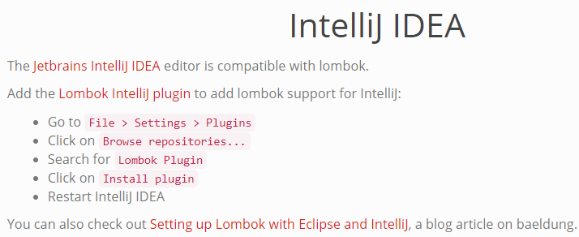
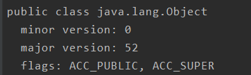

# Lab3 ClassFileParser

## 0. 重要说明

从本次实验开始，我们将使用第八版[JVM规范](https://docs.oracle.com/javase/specs/jvms/se8/html/index.html)作为辅助教材，网络上也有中文版的资源可以自行下载，但需要说明，部分实现细节依旧推荐直接看英文版，中文版中有很多翻译容易引起歧义。

看很长的英文文档绝对是一个痛苦的过程，但这个过程会对你有非常大的帮助。在阅读文档时，我们不推荐一次性把文档中的每一个细节都弄清楚，也不推荐把大量的章节读完之后再开始编码。我们会在每一次的实验中规定需要读完的部分，更好的一种做法是先有个大概了解之后再在编码中反复验证自己的理解是否正确，是否有更多的细节需要注意。

同时，从第三次实验开始，将进行查重。因为框架代码的存在，对重复率的比重要求会相对放低。**但是**，我们必须提醒，有很多看起来能够绕开查重的”聪明办法“实际上是不可行的，这里有一篇延伸阅读[《代码抄袭：那些让985学生沉默，211学生流泪的真相》](https://zhuanlan.zhihu.com/p/40568346)

### 实验更新说明

1. 如果clone了项目之后出现get方法报红的情况，可能需要在IDEA中安装lombok插件。具体方法如下



**2. 由于命名的原因，JVVM-tool.jar中可能抛出一个框架代码的问题 No such method。由于平台上的版本不太好修改，只能请同学们自己注意了。**

大家在UTF8Info中加入以下字段就可以防止报错了。

```java
    private int length;
    private byte[] bytes;
    private String myString;
```

## 1. 实验背景

在上一次的实验中我们已经使用一个ClassFileReader根据类名读取到了class文件，在本次的实验中我们将进一步对这个文件进行操作。JVM规范中使用了一个类似C语言的结构体语法来描述class文件 ：

```java
ClassFile {
	u4 magic; //魔数
	u2 minor_version; //次版本号
	u2 major_version; //主版本号
	u2 constant_pool_count; //常量池数
 	cp_info constant_pool[constant_pool_count-1]; //常量池
	u2 access_flags; //访问标志
	u2 this_class; //类名的常量池索引
	u2 super_class; //父类类名的常量池索引
	u2 interfaces_count; //接口个数
	u2 interfaces[interfaces_count]; //接口名的常量池索引
	u2 fields_count; //字段数
	field_info fields[fields_count]; //字段表
	u2 methods_count; //方法数
	method_info methods[methods_count]; //方法表
	u2 attributes_count; //属性数
	attribute_info attributes[attributes_count]; //属性表
}
```

这次小实验的任务就是模仿 JVM 中的 classfile 解析器，正确解析一小部分 classfile 的内容并输出。

关于 class file 的格式在JVM规范的第四章有详细解释，在这份实验说明的最后部分会向大家介绍阅读这部分手册的方法。

## 2. 实验要求

### 2.1 实验输入

测试用例中的流程大致如下(这里进行了简化，不是真正的代码)

```java
byte[] content = ClassFileReader.readClassFile(className);
ClassFile classfile = new ClassFile(content);

\\进行assert测试
assertEquals(expected,real);
...

JClass clazz = new JClass(classfile);
\\进行assert测试
assertEquals(expected,real);
...
```

我们利用了上一次作业中实现的ClassFileReader读取到了对应的文件并转换成了byte数组的形式。我们已经保证了读取文件的正确。

从上面的代码中可以看出，我们有两个主要的类，ClassFile和JClass。实验中只需要保证这两个构造器不被修改即可。同时，这两个类中已有的以get开头的方法请不要随意删除，因为测试需要调用它们。

```java
public ClassFile(byte[] classfile) {...}
public JClass(ClassFile classFile) {...}
```

### 2.2 实验输出

在实验中你的一部分工作是完成这两个构造方法中缺失的部分。我们会调用classFile和clazz这两个变量的getXXX方法进行assert测试。整个测试过程中不会接收任何异常，这意味着你需要catch掉所有可能的异常。

### 2.3 实验要求

本次的实验要求较为分散，在代码中我们使用了 "//todo" 这样的注释对你需要完成的部分进行了标记，并且在缺失代码的地方使用了"/**...Add some codes here.*/"如果你是IDEA用户你可以使用左下角的todo按钮来查看所有的要求。你也可以进行全文搜索todo或"Add some codes here"字符串完成这项任务。

1. 完成ClassFile和JClass构造器中缺失的部分
2. 完成ConstantPoolInfo类中的getConstantPoolInfo方法，你需要补全ClassInfo和UTF8Info的实现并且别忘了在getConstantPoolInfo中对它们进行使用
3. 完成Field构造器中的代码
4. 完成Method类中的计算argc的方法（calculateArgcFromDescriptor）

**需要额外注意：请不要移动已经存在的类，对包结构的改变可能会带来不确定的行为，多数情况下你会面临依赖问题**

### 2.4 代码指导

在这次的代码中我们已经删去了一些可能会影响你阅读源码的部分，例如对属性表的解析，你将在真正的大作业框架中见到它。

#### 完成要求1:

 你需要仔细阅读手册中的class file规范，对于如何处理byte数组我们在相应的构造器代码中已经有一些实现作为参考。一个debug技巧：在ClassFile的构造器代码中我们故意留出了“this.accessFlags = in.getShort();”这条语句。在这条语句之前你需要正确完成常量池部分的代码。你可以将断点打在accessFlags的下一条语句，如果你正确完成了，在执行到断点时，accessFlag的值应该与你通过javap获得的结果是一致的。

例如在正确实现的版本中，java/lang/Object的accessFlags为0x21(IDEA中使用右键see as hex)，查阅手册[4.1节](https://docs.oracle.com/javase/specs/jvms/se8/html/jvms-4.html#jvms-4.1)可以知道0x21是0x01+0x20，即PUBLIC+SUPER。和javap的结果一致  。



在完成了这一步的验证之后再继续编码会让你的信心增强很多~

#### 完成要求2：

在开始实现这个要求之前，你应该已经读过文档中关于常量池的部分。弄清楚每一种常量池中的Info应该是什么样的结构，里面的常量池索引是一个什么概念。

在ConstantPoolInfo类中，你需要完成ClassInfo与UTF8Info。其中ClassInfo相对好实现一点，但无法在UTF8Info完成之前真正完整地实现它。

ClassInfo中的getClassName方法是返回类名，而所有类名都被放在了一个UTF8Info中。

我们故意将这两个类中的所有成员都删除了，目的是让你必须去查阅手册找到这两个结构中到底有什么。你可以轻松的在[4.4节](https://docs.oracle.com/javase/specs/jvms/se8/html/jvms-4.html#jvms-4.4)找到答案。具体的实现我们留出了其他的Info的具体实现，可以对照其中的内容进行实现。**这些类仅仅是留给你作为参考的，不需要修改任何代码，不用被吓到~** 

在UTF8Info的实现中较为困难的一点是，string的长度并不是固定不变的，因此对于getConstantPoolInfo方法中的bytesRead变量来说是无法直接增加一个默认值的。你可以有很多种方法来提供这个信息。

#### 完成要求3：

到这里我们进入了完成JClass的阶段，Field与Method十分类似，参考Method的实现你就可以轻松的完成Field的实现。这个要求只是希望你可以熟悉一下Method和Field中具体有哪些内容。

#### 完成要求4：

首先要完成这部分的内容你需要阅读手册[4.3.3](https://docs.oracle.com/javase/specs/jvms/se8/html/jvms-4.html#jvms-4.3)部分，规范中规定了方法的描述符具有如`({ParameterDescriptor} ) ReturnDescriptor` 的形式，我们对官方给出的例子稍加修改

```java
Object m(int[] i, double d, Thread t) {...}

([IDLjava/lang/Thread;)Ljava/lang/Object;
```

方法m的返回值是Object类，它接收三个参数，参数的类型分别为int[]、double、Thread类。在JVM中有一些基本的类型，分别为BCDFIJSZ，以及数组类型[，其余的则是以L开头以分号结尾的类类型。在描述符中，会按照源码中的顺序排列对应的简写表达，例如[I对应int[]，D对应double，Ljava/lang/Thread;对应Thread类。

要进行argc计算，argc在这里的含义代表着方法中的参数占据的空间，除了J(long)和D(double)占据两个空间，其余都占据一个空间。如果要对上面这个进行argc的计算，**你将会得到的结果是4，而不是3。**在你的代码实现中也需要注意这一点。

> 如果你使用javap -v去查看class文件的信息，也许你会得到和这里的argc不一样的结果，不用惊讶。在javap的输出中argsize计算的是数量而不是空间，所以long会被当成1来计算。而且你会看到一个参数为空的方法的argsize为1，那是因为有一个隐式的this，如果是static的方法就不会有这个this，因为它是类方法，和实例无关。

**除此之外，你需要注意数组的表达含义**，数组符号[本身不能够被计算进argc中，因为数组符号必须和一个非数组符号结合才有实际的意义，这个非数组符号必须出现在1或多个数组符号的右边。即使是[[[[[[[Ljava/lang/String;这样的表示，它也只能够被当成一个多维的String数组，被计算成1。并且在数组的表示中它不会被中断，从遇到第一个数组符号[开始到遇到一个非数组符号结束，这中间绝对不会有非数组符号出现，否则就会被认为是两个/多个数组。

在实现方法时如果出现多个if-else，请将它转换成switch或者表驱动(表驱动这里没必要)。主要的理由是多个if-else不仅在可读性上有很大的问题，并且会带来一定的性能影响。在后续的实验中，你会理解这两者在字节码层次上的区别。

## 3. 手册简介

对于本实验有帮助的部分集中在手册的 4.1-4.7 节，其它内容有兴趣的同学可以自行阅读探索。

4.1 是对 classfile 整体结构的简介和说明 4.2 可以跳过 4.3 是对“类型描述符”组织形式的说明，其中 4.3.2 用到的表示方式是“上下文无关文法(Context Free Grammar)”, 有兴趣的同学可以自行进一步了解（欢迎选修“计算理论初步”）。

在这里简单介绍一下它描述的意思： Descriptor 可以是 BaseType, ObjectType, ArrayType 的一种， 如果是 BaseType，它一定是 BCDFIJSZ 中的一个字母； 如果是 ObjectType，它是`L<类名>;` ; 如果是 ArrayType，它是`[<成员描述符>`，其中成员描述符又是一个 Descriptor，可以是 BaseType, ObjectType, ArrayType 的一种……

例如，二维`int`数组可以这样表示： 首先它是一个数组，数组的成员是一维`int`数组， 所以描述符是`[<一维int数组描述符>`； 而一维`int`数组也是一个数组，它的成员是`int`, 所以可以将上述描述符展开成`[[<int描述符>`； 而`int`是一个基本类型，它的描述符是 BaseType 中的 I， 所以展开为`[[I`，至此，没有再能展开的描述符了， 于是得到二维`int`数组描述符为`[[I`。

试着自行解读 4.3.3 中对方法描述符的表示，并试图写出下面这个方法的描述符

```
int[] foo(int i, Integer i2, Object o);
```

4.4 是对常量池信息的描述，特别需要提醒的是 4.4.7 Utf8_info 中，有对 `modified UTF-8`格式的描述，感兴趣的同学可以自行查阅文字编码相关的更多资料，在实现中直接使用`String`的构造器`String(byte[])`即可把对应的`modified UTF-8`序列变成 Java 字符串。

4.5-4.6 内容较为简单，大家如果有问题可以相互讨论或在群里提问

4.7 中有对 attribtue 的详细解读，在后续的实验中会有更进一步的讲解

> 上面的指南是我能想到的一些可能会让新手比较困惑的地方，但是即使有了这个指南，读手册依然是一件很有难度的事情。实际上，在理解了手册内容之后，本实验的难度并不高。训练大家阅读手册的能力是这个实验最重要的目的之一。
>
> 手册上是对 JVM 严谨的描述，所以有些内容其实可读性不是那么好，甚至需要来回读几次才能理解。这个过程需要花费时间，但是是有价值的。